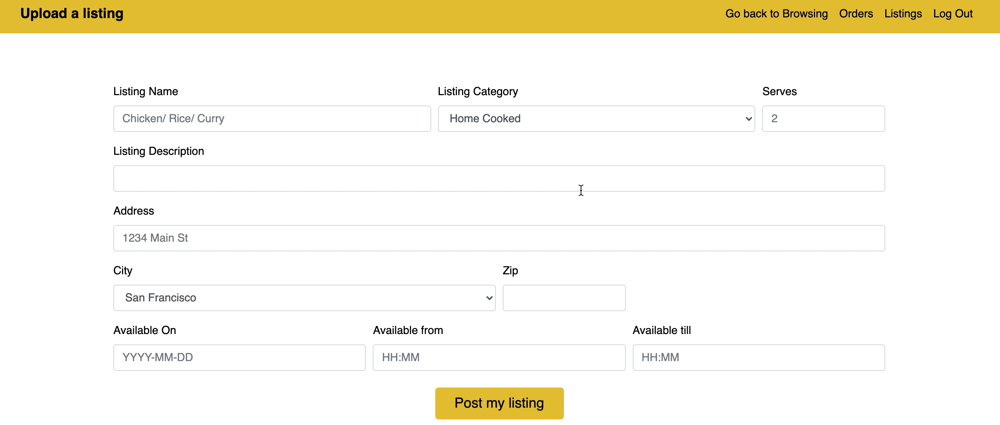

# HomNom WebApp

HomNom's mission is democratize access to and reduce wastage of food. It serves as a platform to connect those with food to spare with those who need the food or those who are bored of the same restaurants each week and want to try some new food options - wherein transaction will be materialize strictly in a non-monetary way.

## Demo
Here is a video demo: https://youtu.be/Jf1RajdgBrE

### Landing Page
A token is generated for easy login for returning users.

### Uploading a Listing
Posters can upload food which would immediately be reflected on map with details of their listing and they also have an option to update servings of their own listings.

Posters and Users can see the logs of their listings and orders.

### Browing and Order Page

HomNom uses geolocation and date-time filter to show food nearby. Each listing displays name, category and description of the food item, address of pickup, time window of food availability and its quantity in terms of servings.

Users can request food for pickup at most for 4 people per listing. Each time a request is made, listing is updated to reflect current level of servings and an SMS is sent to the user and the poster.

## Built with

* React : Build one page web app which conditinally renders individual components.
* Python : Backen language.
* Twilio's REST API : To send an SMS on order confirmation.
* Google Maps : For easy browsing.
* SQLAlchemy : To update data schema.
* Bootstrap : Extensive list of components and Bundled Javascript plugins.
